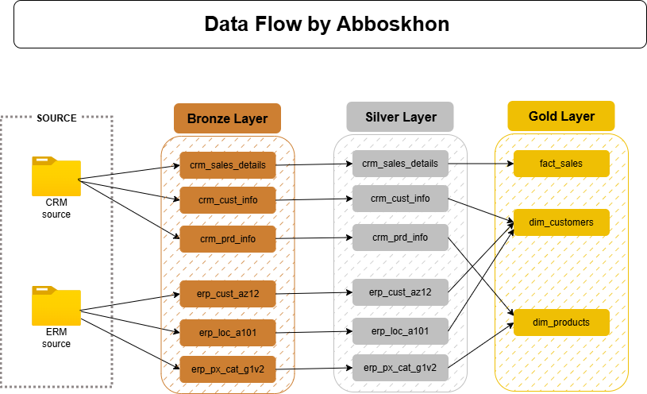

# Data Warehouse Project

A SQL Server data warehouse built on the **Medallion Architecture** (Bronze - Silver - Gold), integrating data from CRM and ERP source systems into a star-schema analytical model.



## Project Structure

```
DataWharehouse_project/
├── datasets/
│   ├── CRM_source/          # CRM flat-file exports
│   │   ├── cust_info.csv        # Customer master data
│   │   ├── prd_info.csv         # Product catalog
│   │   └── sales_details.csv    # Sales transactions
│   └── ERP_source/          # ERP flat-file exports
│       ├── CUST_AZ12.csv       # Customer demographics (birthdate, gender)
│       ├── LOC_A101.csv        # Customer location / country
│       └── PX_CAT_G1V2.csv    # Product category hierarchy
├── scripts/
│   ├── init_database.sql         # Database & schema creation
│   ├── bronze/
│   │   ├── ddl_bronze.sql            # Bronze table definitions
│   │   └── load_procedure_bronze.sql # Bronze ingestion procedure
│   ├── silver/
│   │   ├── ddl_silver.sql            # Silver table definitions
│   │   └── load_procedure_silver.sql # Silver transformation procedure
│   └── gold/
│       └── ddl_view_gold.sql         # Gold-layer views (dimensions & fact)
├── tests/
│   ├── quality_check_silver.sql  # Silver-layer data quality checks
│   └── quality_check_gold.sql    # Gold-layer integrity checks
└── docs/
    └── data_flow.png            # Architecture diagram
```

## Architecture

### Prerequisites

- **SQL Server** (with `BULK INSERT` support)
- CSV source files placed at the paths referenced in the bronze load procedure

### Execution Order

Run the scripts in the following order:

| Step | Script | Purpose |
|------|--------|---------|
| 1 | `scripts/init_database.sql` | Creates the `DataWharehouse` database and the `bronze`, `silver`, `gold` schemas |
| 2 | `scripts/bronze/ddl_bronze.sql` | Creates all bronze-layer tables |
| 3 | `scripts/bronze/load_procedure_bronze.sql` | Creates the `bronze.load_bronze` stored procedure |
| 4 | `EXEC bronze.load_bronze` | Runs the procedure to ingest CSV data into bronze |
| 5 | `scripts/silver/ddl_silver.sql` | Creates all silver-layer tables |
| 6 | `scripts/silver/load_procedure_silver.sql` | Creates the `silver.load_silver` stored procedure |
| 7 | `EXEC silver.load_silver` | Runs the procedure to transform bronze data into silver |
| 8 | `scripts/gold/ddl_view_gold.sql` | Creates the gold-layer views |

## Layer Details

### Bronze Layer (Raw Ingestion)

Loads raw CSV data as-is into staging tables using `BULK INSERT`. No transformations are applied. Tables are truncated before each load (full-refresh pattern).

**Tables:**

| Table | Source | Description |
|-------|--------|-------------|
| `bronze.crm_cust_info` | CRM | Customer master records |
| `bronze.crm_prd_info` | CRM | Product catalog |
| `bronze.crm_sales_details` | CRM | Sales transactions |
| `bronze.erp_cust_az12` | ERP | Customer demographics |
| `bronze.erp_loc_a101` | ERP | Customer locations |
| `bronze.erp_px_cat_g1v2` | ERP | Product categories |

### Silver Layer (Cleansed & Standardized)

Transforms bronze data with the following operations:

- **Deduplication** -- customers are deduplicated by `cst_id`, keeping the most recent record
- **Data type casting** -- integer-encoded dates (e.g. `20230115`) are converted to `DATE`
- **Standardization** -- gender codes (`M`/`F`) expanded to full labels (in Russian: Мужчина/Женщина); marital status codes expanded with gender context; product line codes (`M`/`R`/`S`/`T`) mapped to full names (Mountain, Road, Other Sales, Touring); country codes normalized (`DE` -> Germany, `US`/`USA` -> United States)
- **Key extraction** -- composite product keys are split into `cat_id` and `prd_key`
- **Null handling** -- null costs default to 0; invalid/future birth dates are nullified; missing sales amounts are recalculated as `quantity * price`
- **Date range derivation** -- product `prd_end_dt` is derived via `LEAD()` window function
- **Prefix cleanup** -- `NAS` prefix stripped from ERP customer IDs; hyphens removed from location customer IDs
- **Audit column** -- `dwh_create_date` added to all silver tables

### Gold Layer (Business-Ready / Star Schema)

Presents clean, analytical views following a star-schema design:

| View | Type | Description |
|------|------|-------------|
| `gold.dim_customers` | Dimension | Unified customer view joining CRM master data with ERP demographics and location. Generates a surrogate `customer_key`. Gender resolved with CRM-first priority, ERP as fallback. |
| `gold.dim_products` | Dimension | Active products only (`prd_end_dt IS NULL`) enriched with category/subcategory from ERP. Generates a surrogate `product_key`. |
| `gold.fact_sales` | Fact | Sales transactions linked to dimension surrogate keys (`product_key`, `customer_key`). |

## Data Quality Tests

### Silver Quality Checks (`tests/quality_check_silver.sql`)

- Primary key uniqueness and null checks on `crm_cust_info`, `crm_prd_info`
- Whitespace detection in key string fields
- Consistency checks for standardized values (marital status, gender, product line, country, maintenance)
- Negative/null cost validation
- Date range validity (`prd_end_dt >= prd_start_dt`, `order_dt <= ship_dt <= due_dt`)
- Sales consistency (`sales = quantity * price`)
- Birthdate range validation

### Gold Quality Checks (`tests/quality_check_gold.sql`)

- Surrogate key uniqueness for `dim_customers` and `dim_products`
- Referential integrity between `fact_sales` and both dimension views (no orphan keys)
